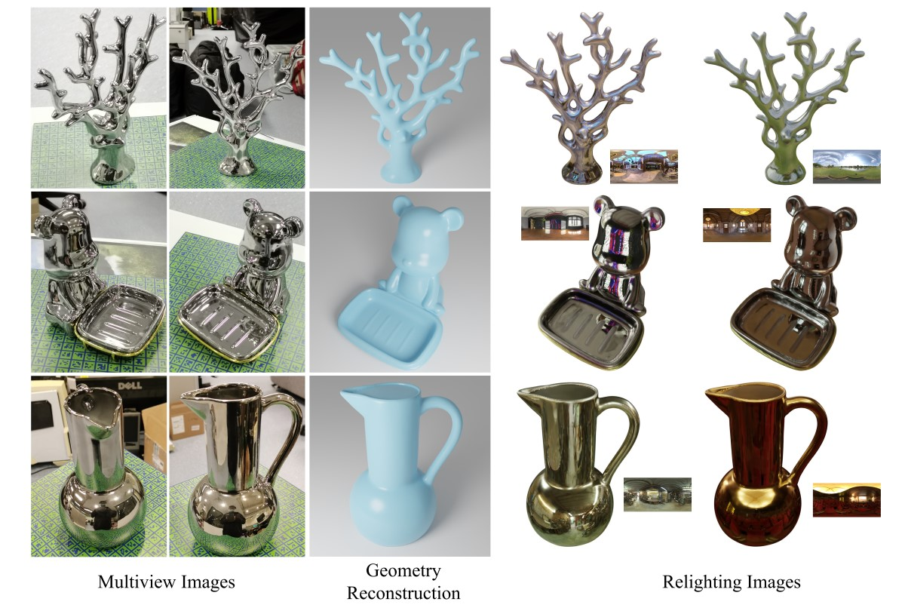

# NeRO
NeRO: Neural Geometry and BRDF Reconstruction of Reflective Objects from Multiview Images


## [Project page](https://liuyuan-pal.github.io/NeRO/) | [Paper](https://arxiv.org/abs/2305.17398)

### Update

2023.07.26 Thanks @[ingra14m](https://github.com/ingra14m) for adding support for the NeRF-blender datasets (ShinyObject/NeRF-Synthetic). These codes are included in the `nerf-syn` branch https://github.com/liuyuan-pal/NeRO/tree/nerf-syn. Welcome to try it!

2024.04.14 Thanks @[bell-one](https://github.com/bell-one) for adding a material extraction module. Now we can extract the materials to UV maps instead of defining them on the vertices. Check out [extract_materials_texture_map.py](extract_materials_texture_map.py) for this function!

## Usage
### Setup
1. Install basic required packages.
```shell
git clone https://github.com/liuyuan-pal/NeRO.git
cd NeRO
pip install -r requirements.txt
```
2. Install `nvdiffrast`. Please follow instructions here [https://nvlabs.github.io/nvdiffrast/#installation](https://nvlabs.github.io/nvdiffrast/#installation).
3. Install `raytracing`. Please follow instructions here [https://github.com/ashawkey/raytracing](https://github.com/ashawkey/raytracing).

### Download datasets

Models and datasets all can be found [here](https://connecthkuhk-my.sharepoint.com/:f:/g/personal/yuanly_connect_hku_hk/EvNz_o6SuE1MsXeVyB0VoQ0B9zL8NZXjQQg0KknIh6RKjQ?e=MaonKe).

### Stage I: Shape reconstruction

1. In the `NeRO` directory, ensure that you have the following data:
```
NeRO
|-- data
    |-- GlossyReal
        |-- bear 
            ...
    |-- GlossySynthetic
        |-- bell
            ...
```
2. Run the training script
```shell
# reconstructing the "bell" of the Glossy Synthetic dataset
python run_training.py --cfg configs/shape/syn/bell.yaml

# reconstructing the "bear" of the Glossy Real dataset
python run_training.py --cfg configs/shape/real/bear.yaml
```
Intermediate results will be saved at `data/train_vis`. Models will be saved at `data/model`.

3. Extract mesh from the model.
```shell
python extract_mesh.py --cfg configs/shape/syn/bell.yaml
python extract_mesh.py --cfg configs/shape/real/bear.yaml
```
The extracted meshes will be saved at `data/meshes`.

### Stage II: Material estimation

1. In the `NeRO` directory, ensure that you have the following data:
```
NeRO
|-- data
    |-- GlossyReal
        |-- bear 
            ...
    |-- GlossySynthetic
        |-- bell
            ...
    |-- meshes
        | -- bell_shape-300000.ply
        | -- bear_shape-300000.ply
             ...
```
2. Run the training script:
```shell
# estimate BRDF of the "bell" of the Glossy Synthetic dataset
python run_training.py --cfg configs/material/syn/bell.yaml

# estimate BRDF of the "bear" of the Glossy Real dataset
python run_training.py --cfg configs/material/real/bear.yaml
```
Intermediate results will be saved at `data/train_vis`. Models will be saved at `data/model`.

3. Extract materials from the model.
```shell
python extract_materials.py --cfg configs/material/syn/bell.yaml
python extract_materials.py --cfg configs/material/real/bear.yaml
```
The extracted materials will be saved at `data/materials`.

### Relighting

1. In the `NeRO` directory, ensure that you have the following data:
```
NeRO
|-- data
    |-- GlossyReal
        |-- bear 
            ...
    |-- GlossySynthetic
        |-- bell
            ...
    |-- meshes
        | -- bell_shape-300000.ply
        | -- bear_shape-300000.ply
             ...
    |-- materials
        | -- bell_material-100000
            | -- albedo.npy
            | -- metallic.npy
            | -- roughness.npy
        | -- bear_material-100000
            | -- albedo.npy
            | -- metallic.npy
            | -- roughness.npy
    |-- hdr
        | -- neon_photostudio_4k.exr
```
2. Run relighting script
```shell
python relight.py --blender <path-to-your-blender> \
                  --name bell-neon \
                  --mesh data/meshes/bell_shape-300000.ply \
                  --material data/materials/bell_material-100000 \
                  --hdr data/hdr/neon_photostudio_4k.exr \
                  --trans
                  
python relight.py --blender <path-to-your-blender> \
                  --name bear-neon \
                  --mesh data/meshes/bear_shape-300000.ply \
                  --material data/materials/bear_material-100000 \
                  --hdr data/hdr/neon_photostudio_4k.exr
```
The relighting results will be saved at `data/relight` with the directory name of `bell-neon` or `bear-neon`. This command means that we use `neon_photostudio_4k.exr` to relight the object.


### Training on custom objects

Refer to [custom_object.md](custom_object.md).

### Evaluation

Refer to [eval.md](eval.md).

## Acknowledgements
In this repository, we have used codes from the following repositories. 
We thank all the authors for sharing great codes.

- [NeuS](https://github.com/Totoro97/NeuS)
- [NvDiffRast](https://github.com/NVlabs/nvdiffrast)
- [NvDiffRec](https://github.com/NVlabs/nvdiffrec)
- [Ref-NeRF](https://github.com/google-research/multinerf)
- [RayTracing](https://github.com/ashawkey/raytracing)
- [COLMAP](https://colmap.github.io/)

## Citation
```
@inproceedings{liu2023nero,
  title={NeRO: Neural Geometry and BRDF Reconstruction of Reflective Objects from Multiview Images},
  author={Liu, Yuan and Wang, Peng and Lin, Cheng and Long, Xiaoxiao and Wang, Jiepeng and Liu, Lingjie and Komura, Taku and Wang, Wenping},
  booktitle={SIGGRAPH},
  year={2023}
}
```
