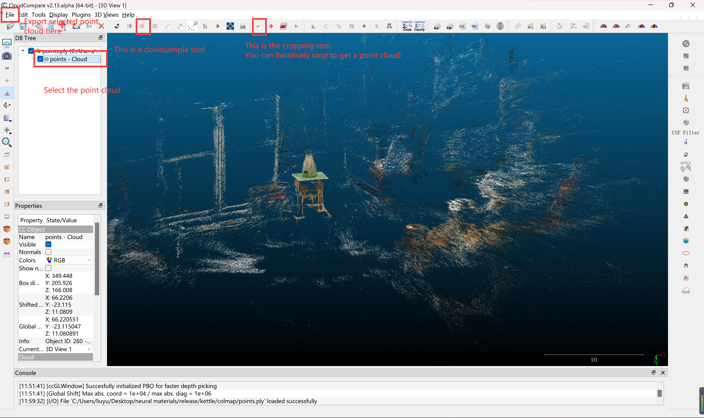
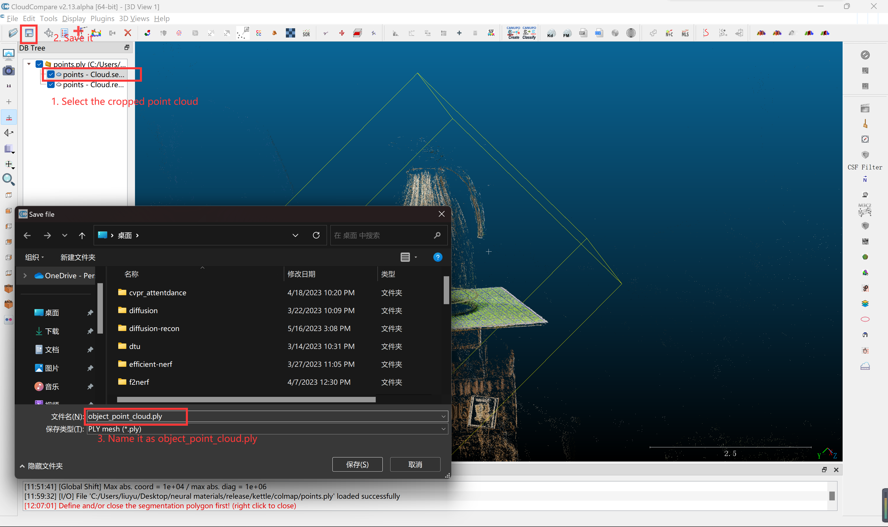
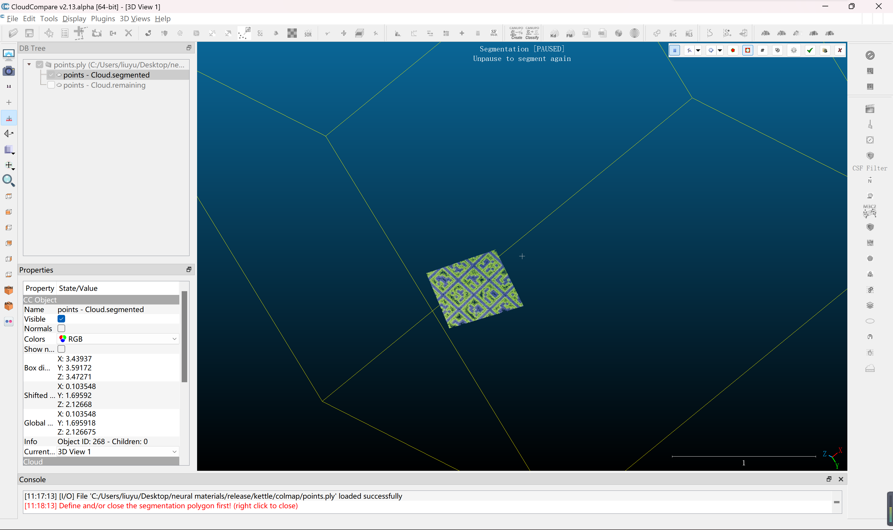
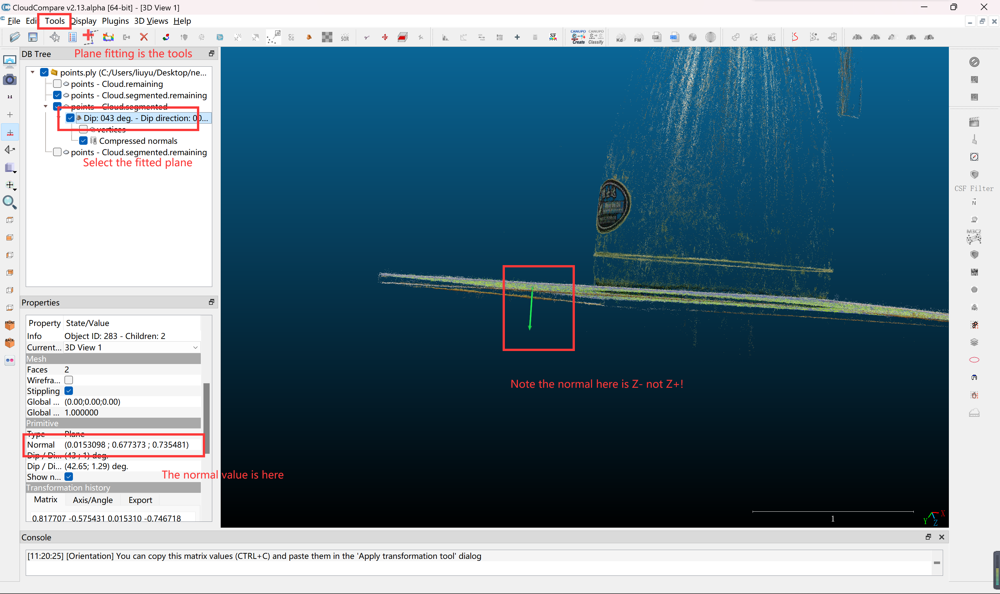
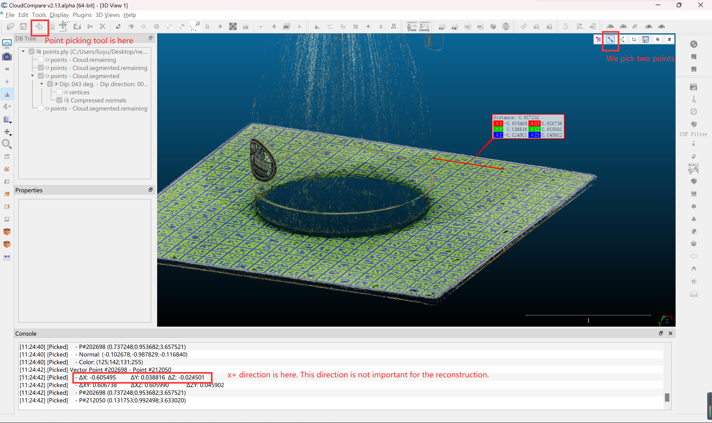
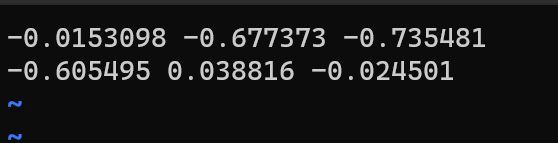
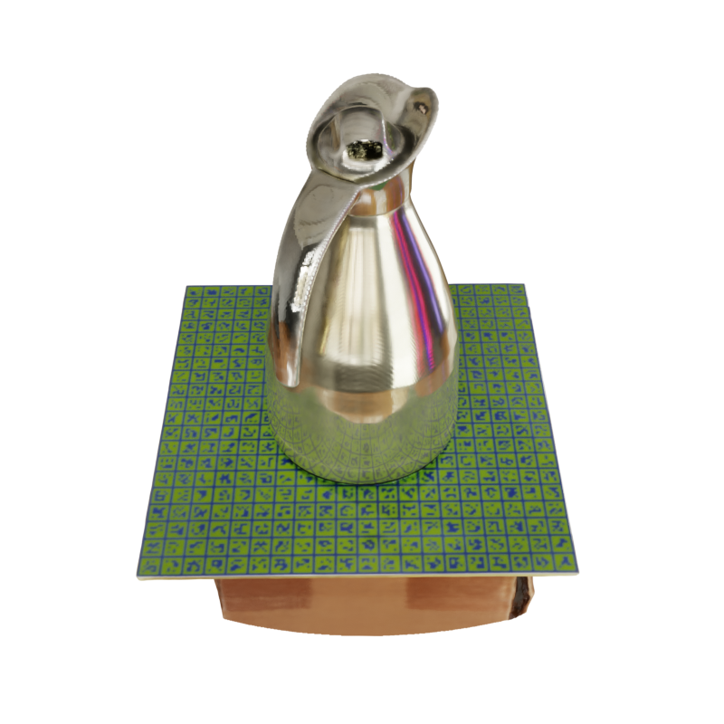

## Reconstructing custom objects

In the following, we will reconstruct a `kettle` object.

1. Download the images for the `kettle` object from [here](https://connecthkuhk-my.sharepoint.com/:f:/g/personal/yuanly_connect_hku_hk/EvNz_o6SuE1MsXeVyB0VoQ0B9zL8NZXjQQg0KknIh6RKjQ?e=MaonKe).
`kttle.zip` contains only the images. `kettle_processed.zip` contains all the processed intermediate results.
2. Organize files like
   ```
   NeRO
   |-- data
       |-- custom
           |-- kettle
               |-- images
   ```
3. Run COLMAP to recover camera poses.
   ```shell
   # run colmap on the kettle and all images are captured by the same camera.
   python run_colmap.py --project_dir data/custom/kettle --colmap <path-to-your-colmap-exe> --same_camera
   ```
4. We need to specify the region we want to reconstruct. We achieve that by cropping a point cloud from the point cloud reconstructed by COLMAP. 
   **Note the point cloud is only used to compute the bounding sphere, but not for the reconstruction**.
   As an example, we use the [CloudCompare](https://www.cloudcompare.org/) as the tool.
   The reconstructed point cloud locates at `data/custom/kettle/colmap/point.ply`.
   
   Export the cropped point cloud as `object_point_cloud.ply`.
   
   Place the `object_point_cloud.ply` at `data/custom/kettle/object_point_cloud.ply`.
   **We provide a video [here](https://connecthkuhk-my.sharepoint.com/:v:/g/personal/yuanly_connect_hku_hk/EZrJbCX2ebxAugvPd2H64OQB4oz4RCPQaMJ0HXCdUeJYYA?e=lS3kSf). LMB means Left-Mouse-Button, RMB means Right-Mouse-Button and MMB means Middle-Mouse-Button**
5. Manually specify the forward (x+) direction and the up (z+) direction for the object. 
   For the z+ direction, we may crop a horizontal point cloud first:
   
   
   Then, we fit a plane on the cropped point cloud. And its normal is the Z+ or Z- direction.
   
   Then, we use the point picking tool to specify the X+ direction.
   
   Write a `data/custom/kettle/meta_info.txt` with the content:
   
   The first line is the `Z+` direction and the second line is the `X+` direction.
   Your results may be different from mine since the reconstructed point cloud of COLMAP may have a different coordinate system.
   **We provide a video [here](https://connecthkuhk-my.sharepoint.com/:v:/g/personal/yuanly_connect_hku_hk/EYRhCQmWUqNIgLIFGvGrRkIBGaffGCW7QNIx1HqwWz1rig?e=KG4hjY). LMB means Left-Mouse-Button, RMB means Right-Mouse-Button and MMB means Middle-Mouse-Button**
   You may also refer to [this issue](https://github.com/liuyuan-pal/Gen6D/issues/7#issuecomment-1191033327) and [this markdown](https://github.com/liuyuan-pal/Gen6D/blob/main/custom_object.md).
6. Make sure that you have the following files, which are generated by above steps.
   ```shell
   Gen6D
   |-- data
       |-- custom
          |-- kettle
              |-- object_point_cloud.ply  # object point cloud
              |-- meta_info.txt           # meta information about z+/x+ directions
              |-- images                  # images
              |-- colmap                  # colmap project
   ```
7. Run the shape reconstruction by
   ```shell
   python run_training.py --cfg configs/custom/kettle_shape.yaml
   ```
8. Extract the reconstructed mesh by
   ```shell
   python extract_mesh.py --cfg configs/custom/kettle_shape.yaml
   ```
   The resulted mesh will be saved at `data/meshes/kettle_shape-300000.ply`.
9. Run the material estimation by
   ```shell
   python run_training.py --cfg configs/custom/kettle_material.yaml
   ```
10. Extract the material by
   ```shell
   python extract_materials.py --cfg configs/custom/kettle_material.yaml
   ```
   The extracted materials will be saved at `data/materials/kettle_material-100000`.

11. Relighting
   ```shell
   python relight.py --blender <path-to-your-blender> \
                  --name kettle-neon \
                  --mesh data/meshes/kettle_shape-300000.ply \
                  --material data/materials/kettle_material-100000 \
                  --hdr data/hdr/neon_photostudio_4k.exr
   ```
   You should see images in the `data/relight/kettle-neon`.
   
   
